★Pyxel Games made by Koidemizu.★ 
============== 
 

## Overview 
My retro game collection using pyxel (python game engne). 
 
## Invaders 
A retro shooting game like Space Invaders. 
 

### pyxel_knights 
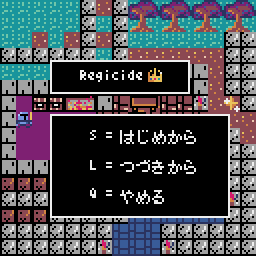 
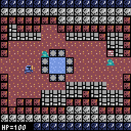 
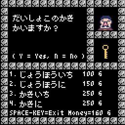 
レトロアクションRPG。 
セーブ・ロード機能があります。 
リポジトリは下記の場所に移動しました。 
Fantasy RPG game. 
It has a save/load function. 
The repository has been moved to the following location. 
https://github.com/koidemizu/pyxel_knights
 

### pyxel_knights_ae 
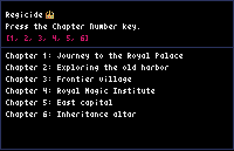 
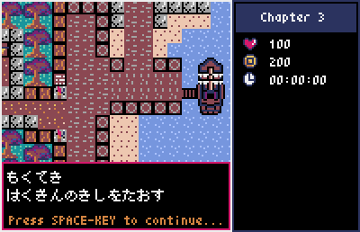 
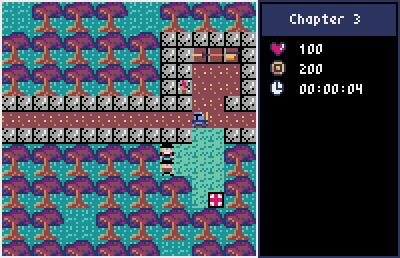 
"pyxel_knights"を改造して作ったものです。 
セーブ・ロード機能を廃止し、ステージクリア型のゲームにしました。 
リポジトリは下記の場所に移動しました。 
A modified version of "pyxel_knights". 
This is a modified version of "pyxel_knights" with no save/load function. 
The repository has been moved to the following location. 
https://github.com/koidemizu/pyxel_knights_ae
 

### sengoku 
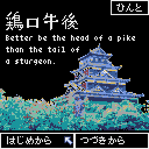 
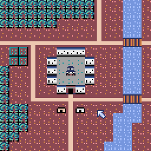 
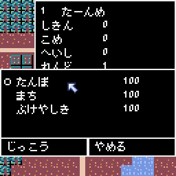 
日本の「戦国時代」をテーマにしたシミュレーションゲームです。 
プレイヤーは小さな領地の主となって、自国を発展させることを目指します。 
リポジトリは下記の場所に移動しました。 
A simulation game based on Japan's "Sengoku-Jdai". 
The player becomes the lord of a small territory and aims to develop his country. 
The repository has been moved to the following location. 
https://github.com/koidemizu/sengoku
 

### maze 
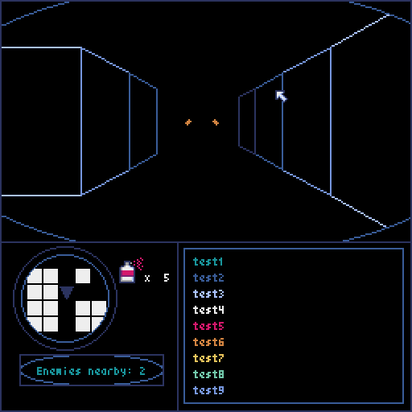 
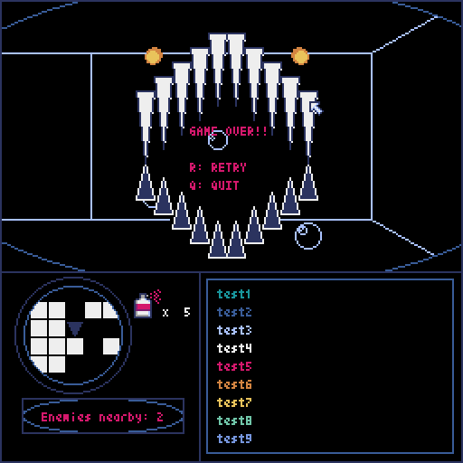 
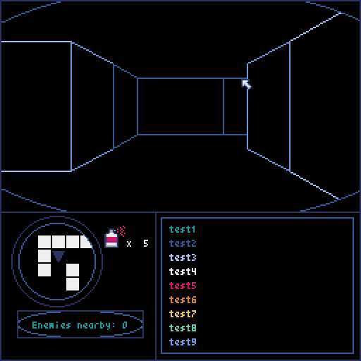 
深海のダンジョンをイメージした迷路ゲーム。 
リポジトリは下記の場所に移動しました。 
A game about exploring a maze on the sea floor. 
The repository has been moved to the following location. 
https://github.com/koidemizu/pyxel_maze
 
